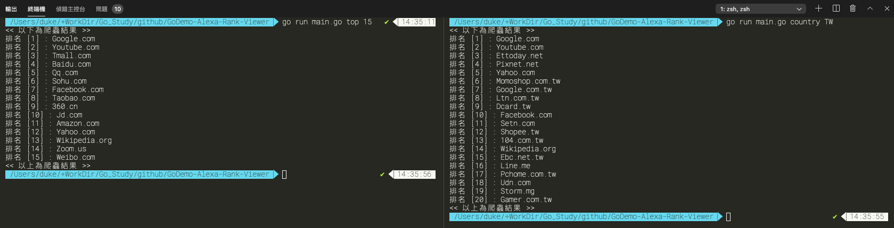

Alexa-Rank-Viewer 爬蟲專案展示.

## 前言
採用goquery爬蟲框架，透過CLI指令介面實踐兩者功能
* top <number> : 檢索alexa.com世界前10名網域
* country <country> :  檢索alexa.com各國世界前20名網域
 
```
$ ./clawer top <number> 
$ ./clawer country <country> 
```
``number`` 依照目前網站呈現來看最多能爬到前50名
``country`` 依照目前網站國家分類有：``TW``,``JS``,``US`` ...


## 測試結果

## 檔案樹說明
```bash
├── build/ #專案編譯完成執行檔放置處
├── pkg/ #golang main() 公有pkg 
│   ├── crawler/ #爬蟲模組
│   └── flags/ #執行檔參數模組
├── runBuild.sh #build執行檔腳本（編譯完成自動放置至./build）
├── runUnitTest.sh #執行所有pkg單元測試
├── demo.png #執行結果結圖
├── go.mod #golang版控相關
├── go.sum #golang版控相關
└── main.go #main()整體專案入口
```